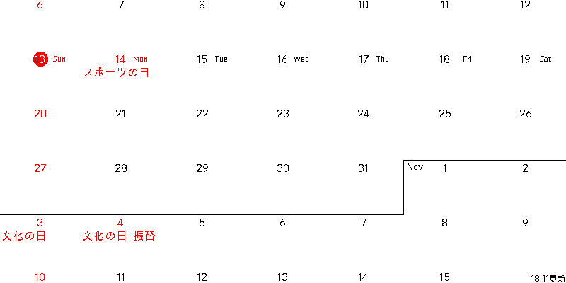

# setup

以下の手順で必要なものをインストールしてください。

```
python -m venv ./
source bin/activate
pip install -r requirements.txt
```

また、適当なフォントファイルを pic/font.ttf
に置いてください。用意しない場合、日本語非対応のフォントが使われます。

# 動かし方

以下のスクリプトを実行すると、raspberry
piがe-paperにカレンダーを描画します。CALENDAR_ICSは自身のgoogleカレンダーのicsファイルを指定してください。

```bash
CALENDAR_ICS= "https://calendar.google.com/calendar/ical/xxx%40gmail.com/private-00000000000000000000000000000000/basic.ics" bash ./draw_calendar.sh
```

# デバッグ方法

scripts/show_image.py
を実行すると、画像生成だけ行えます。e-paperへの出力が行われないのでローカルPCで動作を確認したいときに便利です。
